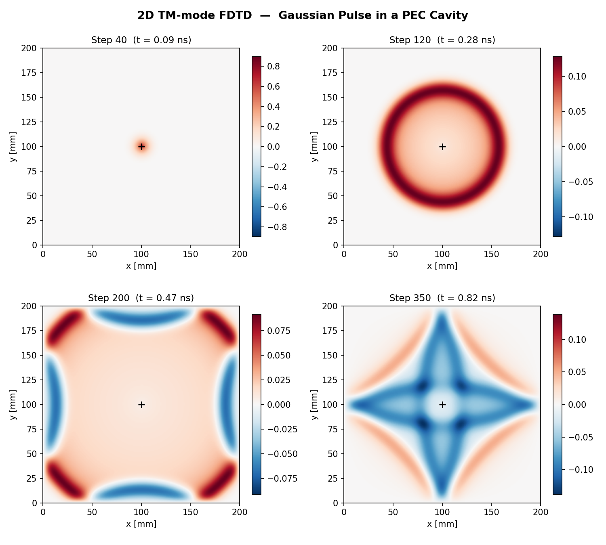

# FDTD Electromagnetic Wave Simulator — GPU Accelerated

A complete optimization pipeline for the Finite-Difference Time-Domain (FDTD) electromagnetic solver, progressing from naive Python loops to highly optimized GPU kernels. **9 implementations** benchmarked on Tesla P100 and Tesla T4.

**Authors:** Vraj Patel (241110080), Vardhman Dwivedi (241060033)  
**Course:** IDC 606 — Fast Computational Hydrodynamics, IIT Kanpur  
**Instructor:** Prof. Mahendra K. Verma

---

## Live Demos

- **[Interactive FDTD Simulator](https://YOUR_USERNAME.github.io/fdtd-em-gpu/)** — run the simulation in your browser with adjustable parameters
- **[Presentation Slides](https://YOUR_USERNAME.github.io/fdtd-em-gpu/fdtd_presentation.html)** — reveal.js slide deck

> Replace `YOUR_USERNAME` with your GitHub username after enabling GitHub Pages (see [Setup](#hosting-the-demo) below).

---

## Results at a Glance

### 9-Version Performance Comparison (Kaggle P100, 200x200 grid, 400 steps)

| Version | Time | ms/step | Speedup vs Loops |
|---------|------|---------|:---:|
| Explicit Python Loops | 48.3 s | 120.66 | 1x |
| NumPy Vectorized | 186 ms | 0.465 | **259x** |
| NVIDIA Warp v1 | 59 ms | 0.147 | 823x |
| NVIDIA Warp v2 | 31 ms | 0.077 | 1,565x |
| Warp Pure (no I/O) | 24 ms | 0.059 | 2,053x |
| CuPy RawKernel | 12 ms | 0.029 | 4,098x |
| CuPy Pure | 6.7 ms | 0.017 | 7,198x |
| CUDA C (full) | 6.5 ms | 0.016 | 7,451x |
| **CUDA C (pure)** | **4.0 ms** | **0.010** | **12,073x** |

### CuPy Optimization Results

After profiling identified that **77% of GPU time was spent on energy computation** (not physics), two targeted optimizations achieved an additional **8x speedup**:

| Version | P100 | T4 |
|---------|:---:|:---:|
| CuPy Original (V2) | 0.185 ms/step | 0.280 ms/step |
| **CuPy Optimized (V3)** | **0.023 ms/step** | **0.031 ms/step** |
| **Speedup** | **7.9x** | **8.9x** |

Optimizations applied:
1. **Warp-shuffle energy reduction** — `__shfl_down_sync` reduces 40,000 `atomicAdd` to 175 (one per block)
2. **Batched energy** — compute every 40 steps instead of every step (11 syncs vs 400)

---

## Simulation

The solver implements 2D TM-mode FDTD with:
- Yee staggered grid (E_z, H_x, H_y)
- Leap-frog time stepping
- PEC (metallic) cavity boundaries
- Gaussian pulse source
- Arbitrary PEC obstacle support (interactive GUI drawing tool)



---

## Project Structure

```
fdtd-em-gpu/
├── notebooks/                        # Clean notebooks (run on Colab/Kaggle)
│   ├── 01_all_versions.ipynb         # All 9 versions: Loops → NumPy → Warp → CuPy → CUDA C
│   ├── 02_cupy_deep_dive.ipynb       # CuPy end-to-end with operation annotations
│   ├── 03_cupy_profiler.ipynb        # Per-operation GPU profiling
│   ├── 04_cupy_optimized.ipynb       # Shuffle reduction + batched energy
│   └── 05_shared_memory_1000x1000.ipynb  # Shared memory experiment
│
├── results/                          # Executed notebooks with outputs
│   ├── kaggle_p100/                  # Tesla P100 results
│   │   ├── all_versions.ipynb
│   │   ├── cupy_optimized.ipynb
│   │   └── profile/                  # JSON + PNG profiling data
│   └── colab_t4/                     # Tesla T4 results
│       ├── all_versions.ipynb
│       ├── cupy_optimized.ipynb
│       └── profile/
│
├── media/                            # Images and video
│   ├── fdtd_animation.mp4           # Simulation video with PEC obstacle
│   ├── composite_snapshots.png
│   └── energy_conservation.png
│
├── video_generator/
│   └── fdtd_video_generator.py      # MP4 generator with GUI obstacle drawing
│
├── docs/                            # GitHub Pages serves from here
│   ├── index.html                   # Interactive FDTD simulator
│   └── fdtd_presentation.html       # Reveal.js presentation
│
├── reports/
│   ├── fdtd_report.pdf              # Project report
│   └── gpu_optimization_report.tex
│
└── README.md
```

---

## Quick Start

### Run on Google Colab (no setup needed)

Open any notebook in `notebooks/` and click the Colab badge, or upload to Colab manually.

### Run the video generator locally

```bash
# With GUI (draw your own obstacle)
python video_generator/fdtd_video_generator.py

# Without GUI (preset circle obstacle)
python video_generator/fdtd_video_generator.py --no-gui
```

Requires: `numpy`, `matplotlib`, `ffmpeg`

---

## Key Technical Insights

### Why each optimization layer matters

| Transition | What's removed | Speedup |
|-----------|---------------|:---:|
| Loops → NumPy | Python interpreter per element | 259x |
| NumPy → Warp GPU | CPU serial execution | 3.2x |
| Warp v1 → v2 | Python wrapper object creation | 1.9x |
| Warp → CuPy | Warp dispatch overhead | 3.5x |
| CuPy → CUDA C | Python interpreter per step | 1.7x |

### Why float32 on GPU, float64 on CPU?

GPU float32 throughput is 2x float64 (32x on T4). The FDTD discretization error (~dx^2 = 10^-6) exceeds float32 rounding (~10^-7), so extra precision is wasted. Verified: max relative diff = 2.25e-6.

### Why not shared memory at 200x200?

Working set (480 KB) fits entirely in L2 cache (4 MB). Shared memory provides no benefit when L2 already serves as automatic cache. At 1000x1000 (11.7 MB > L2), shared memory helps.

### Why (8, 32) block shape?

32 threads in the j-direction = one full warp reading consecutive memory addresses = coalesced access = 100% bandwidth utilization. A (16, 16) block wastes 50% of bandwidth due to strided access across rows.

---

## Hosting the Demo

To host the interactive simulator and presentation via GitHub Pages:

1. Push this repo to GitHub
2. Go to **Settings → Pages**
3. Set source to **Deploy from a branch**, branch `main`, folder `/docs`
4. Your demos will be live at:
   - `https://YOUR_USERNAME.github.io/fdtd-em-gpu/` (interactive simulator)
   - `https://YOUR_USERNAME.github.io/fdtd-em-gpu/fdtd_presentation.html` (slides)

---

## Course

**IDC 606 — Fast Computational Hydrodynamics**  
Department of Industrial Design, IIT Kanpur  
Instructor: Prof. Mahendra K. Verma  
Semester: Jan-May 2026
